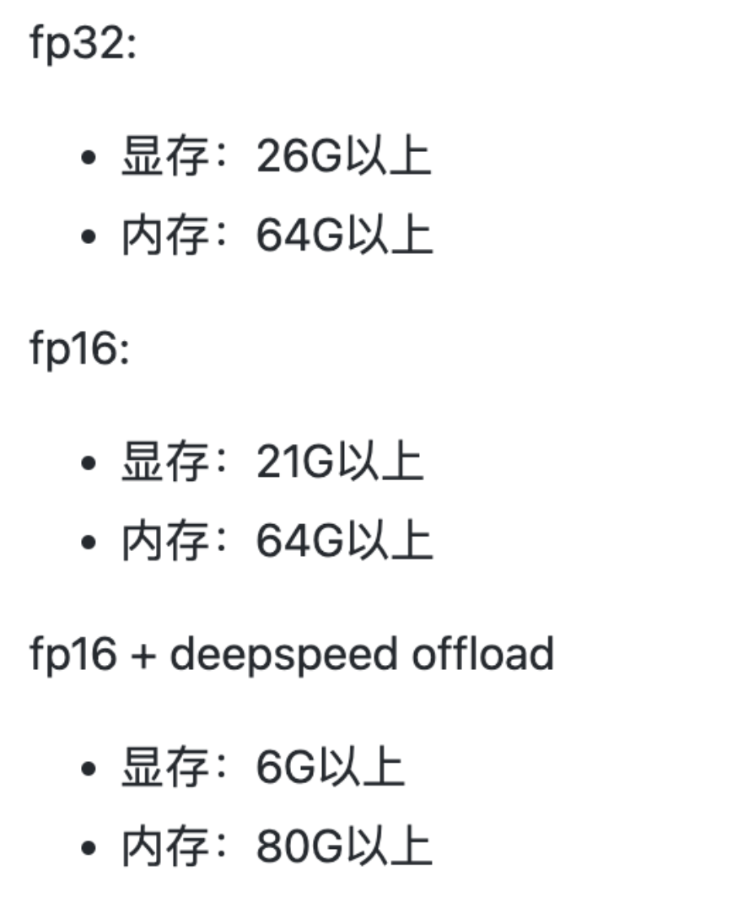

# finetune_stable_diffusion

我公众号：WGS的学习笔记


微调 stable diffusion，首先你应该会引用Huggingface的预训练模型：

https://wangguisen.blog.csdn.net/article/details/127637196

参考封神官网：

https://github.com/IDEA-CCNL/Fengshenbang-LM/tree/main/fengshen/examples/finetune_taiyi_stable_diffusion


还未测试：

Colossal-AI加速：

https://github.com/hpcaitech/ColossalAI/tree/main/examples/images/diffusion

https://github.com/hpcaitech/ColossalAI/blob/main/README-zh-Hans.md


# 关键目录

+ 微调 太乙 stable diffusion：
  + ./finetune/finetune.py
  + ./dk/finetune.sh

+ 太乙 stable diffusion 推理：
  + ./finetune/predict.py

+ 通用 stable diffusion 微调 及 推理 程序:
  + ./finetune/train_zh_model.py
  + ./finetune/run_zh_model.py


# 显存要求




# dockerfile

```
FROM pytorch/pytorch:1.9.1-cuda11.1-cudnn8-devel

RUN echo "" > /etc/apt/sources.list.d/cuda.list
RUN sed -i "s@/archive.ubuntu.com/@/mirrors.aliyun.com/@g" /etc/apt/sources.list
RUN sed -i "s@/security.ubuntu.com/@/mirrors.aliyun.com/@g" /etc/apt/sources.list
RUN apt-get update --fix-missing && apt-get install -y fontconfig --fix-missing
RUN apt-get install -y cmake
RUN apt-get install -y python3.7 python3-pip

RUN ln -sf /usr/share/zoneinfo/Asia/Shanghai /etc/localtime && echo "Asia/Shanghai" > /etc/timezone && \
    pip install -i https://pypi.tuna.tsinghua.edu.cn/simple scipy matplotlib seaborn h5py sklearn numpy==1.20.3 pandas==1.3.5

#RUN pip install -i https://pypi.tuna.tsinghua.edu.cn/simple torchtext==0.11.0
RUN pip install -i https://pypi.tuna.tsinghua.edu.cn/simple ftfy==6.1.1 jieba==0.42.1
RUN pip install -i https://pypi.tuna.tsinghua.edu.cn/simple tensorboardX==2.5 tensorboard==2.2.2
RUN pip install -i https://pypi.tuna.tsinghua.edu.cn/simple datasets==2.6.1 protobuf==3.19.0

RUN pip install -i https://pypi.tuna.tsinghua.edu.cn/simple huggingface_hub==0.10.1 transformers==4.23.1
RUN pip install -i https://pypi.tuna.tsinghua.edu.cn/simple diffusers==0.6.0
RUN pip install -i https://pypi.tuna.tsinghua.edu.cn/simple accelerate==0.11.0 modelcards==0.1.6

RUN pip install -i https://pypi.tuna.tsinghua.edu.cn/simple pytorch_lightning==1.8.1
RUN pip install -i https://pypi.tuna.tsinghua.edu.cn/simple lightning==1.8.1
RUN pip install -i https://pypi.tuna.tsinghua.edu.cn/simple deepspeed==0.7.5
RUN pip install -i https://pypi.tuna.tsinghua.edu.cn/simple onnx==1.12.0 onnxruntime-gpu==1.12

WORKDIR /home
# cd /data/wgs/text2img
# docker build -t wgs-torch:3.0 -f ./dk/Dockerfile .
# docker run --gpus '"device=0,1,2,3"' --rm -it --name test wgs-torch:3.0 bash

#RUN pip install -i https://pypi.tuna.tsinghua.edu.cn/simple --upgrade transformers diffusers

# RUN apt-get install libgl1-mesa-glx -y
```


# 数据处理样式

./data/svg_data


# OneFlow 加速推理

./oneFlow

https://github.com/Oneflow-Inc/diffusers/wiki/How-to-Run-OneFlow-Stable-Diffusion#without-docker


